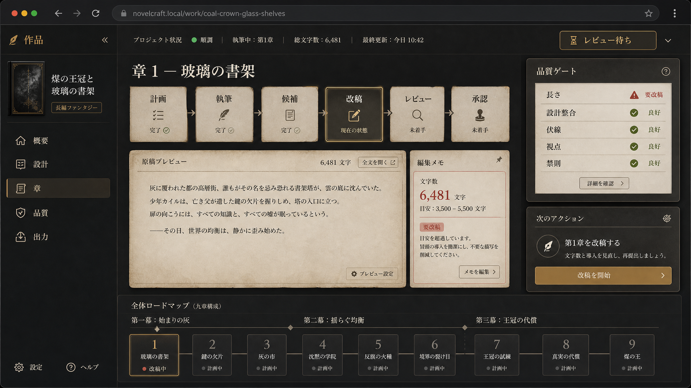
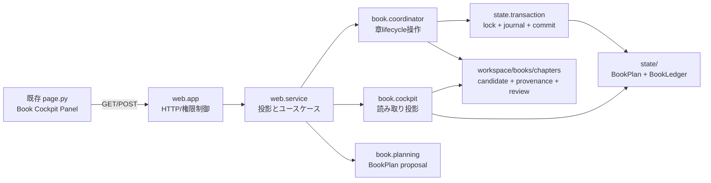

# 長編制作コックピット：実装アーキテクチャ

> **決定**：既存の FastAPI + `web.service` + YAML workspace を維持する。ブラウザは読み取り投影と明示的な制作操作だけを扱い、BookPlan・BookLedger・章artifactの正本を持たない。

本設計は、現在の no-build の単一ページWeb画面を壊さずに、長編制作の計画、章lifecycle、品質、手動承認を追加するための境界を定める。`web.app` はHTTP変換だけを担い、`web.service` がworkspace解決と権限確認を行い、`book` package がtransaction-backedなドメイン操作を所有する。書込みは必ず `project_lock` と `commit_state_diff` を経由し、章候補とレビューは同一commit境界でartifact化する。

## 1. 責務分割

| 層 | 所有する責務 | 禁止事項 |
| --- | --- | --- |
| `web.page` | タブ、章カード、品質表示、明示的な承認操作 | 正本の保持、YAML直接読込み |
| `web.app` | request schema、HTTP status、Originとモードのgate | business logic、StateStore直接操作 |
| `web.service` | project解決、read model整形、権限判定、各use caseへの委譲 | journalやartifactの直接組立て |
| `book.*` | lifecycle、品質、scheduler、artifact、transaction操作 | HTTP知識、UI状態 |
| workspace | BookPlan/BookLedgerと不変artifactの永続化 | UI固有の派生状態 |

## 2. API契約

最初の実装では既存の `/api/project/{name}` 名前空間を保持し、画面が必要とする情報だけを返す。`author`、`full_gm`、`god` 以外の長編制作操作は 403 とし、`player_character` にはBookPlan・BookLedger・未公開候補を開示しない。

| HTTP | endpoint | response / action | 実装先 |
| --- | --- | --- | --- |
| GET | `/book/cockpit` | acts、chapters、active chapter、next action、品質要約 | `get_book_cockpit()` |
| GET | `/book/chapters/{id}` | reader-safe candidate preview、artifact status、review | `get_chapter_detail()` |
| POST | `/book/chapters/{id}/start` | `planned → running` | `start_chapter_production()` |
| POST | `/book/chapters/{id}/review/open` | `candidate → review` | `open_chapter_review()` |
| POST | `/book/chapters/{id}/review` | `review → accepted/revising` | `accept_chapter_review()` / `request_chapter_revision()` |
| GET | `/book/quality` | chapter reviewの集約結果とpublish block理由 | `evaluate_book_quality()` |

候補本文の生成は同期HTTP requestで行わない。将来の `POST /book/chapters/{id}/draft` はrun idを返し、起動中のrun状態をpollする。これにより、既存turnのauto-runと同じ「一project一つの実行」原則を守る。

## 3. 画面情報設計

コックピットは一画面で「次に何をするべきか」と「なぜ出版できないのか」を判断できるようにする。左ナビゲーションには概要・設計・章・品質・出力を置く。中央にはact別の章ロードマップ、選択章のlifecycle、短い原稿preview、review結果を置く。右にはbook quality gateとschedulerのnext actionを固定表示する。

| 画面領域 | 読み取る投影 | 操作 | 成功条件 |
| --- | --- | --- | --- |
| 章ロードマップ | act、lifecycle、word range、review decision | 章を選択 | 進捗と阻害箇所を一瞥できる |
| 章ワークスペース | candidate、provenance、レビュー理由 | start / accept / revise | mutation前に理由と影響を確認できる |
| 品質ゲート | chapter/book quality、block理由 | 詳細へ移動 | 「未承認・長さ・連続性」を区別できる |
| 次アクション | scheduler actionと対象章 | 安全な実行開始 | 適用可能な次手だけを示す |
| 出力 | accepted artifact一覧、export manifest | export開始 | まだ未実装。accepted本文だけを入力にする |

## 4. 初期実装順序

1. `web.service` に `get_book_cockpit()` を追加し、既存 `BookCockpit` の読取り投影をJSON化する。
2. `web.app` に上記GET endpointと、`start` / `review` mutation endpointを追加する。すべてのmutationは既存review routeと同じ409/400変換を行う。
3. `web.page` にBook panelを追加する。初期実装は既存のvanilla JavaScript fetch規約を使い、専用build systemを導入しない。
4. API contract testを追加し、非authorの403、lock conflictの409、idle/read-only状態、accepted/revising状態を固定する。
5. chapter draftingは独立したbackground run導入後に追加する。APIを先に作っても本文生成をrouteに埋め込まない。

## 5. 受入条件

長編画面の最初の出荷は、ユーザーが一つの画面で全章のlifecycle、現在の品質block、次の安全な操作を確認できることを完了条件とする。accepted状態への遷移はartifactとstate diffの双方が保存された場合だけ表示される。書込み失敗、lock conflict、権限不足は画面上で再試行可能な明確なメッセージとして区別する。
