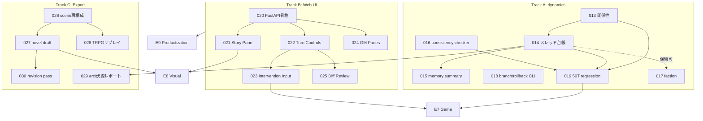

# 全機能スペック & 実装ワークフロー & DAG(2026-07-07確定)

> **完了履歴 / historical (2026-07-13)**: このDAGは完了済み実装の履歴として保持する。現行の
> ユーザー向け導線は`README.md`、規範契約は`docs/spec-foundation.md` §3〜§8、リリース判定は
> `docs/adr/0005-v1-release-contract.md`を参照し、この文書の初期計画を優先しない。

対象: project_plan §20 Phase 4〜9 の全企画機能。Issues 001〜012 完了時点(dynamics第1弾: 脅威・シーン遷移・感情・pacing・文体まで実装済み、469 tests)からの残り全量を、issue粒度スペック+依存DAGに落とす。

進め方は G2 ループ(ADR-0001)のまま: **issue → 調査 → coder委任(ファイル素性が交差しないレーンはworktree並列) → verifier(mock+実LLM) → detect_changes → commit → memory**。OpenSpecは使わない。issue番号がDAGノードID。

---

## Track A: 物語ダイナミクス残り(Phase 5相当・エンジン核)

| # | 機能 | スペック要旨 | 依存 |
|---|---|---|---|
| **013** | 関係性ダイナミクス | `CharacterAgentOutput.relationship_updates`(to/dimension/delta、default空)→ state_managerが既存relationship diff(composite key、clamp完備)へ変換。プロンプトv5に関係更新指針(-15〜+15、scoped相手のみ)。ガード: ペア不存在/self/未知dimensionはreject | なし(**ready**) |
| **014** | 未解決スレッド台帳(伏線) | 既存`UnresolvedThread`スキーマ(id/description/status/related_event_ids、load/save済み・完全不使用)をランタイム化。キャラ/ナレーター出力に `thread_updates`(open/advance/resolve)を追加しdiff化。open threadsをナレーター文脈に供給し「未回収の糸を進める」指示。pacing checkerの前進シグナルに thread advance/resolve を追加。効果: 「カイの既視感ビート6回未回収」型の反復を回収圧に変える | 013(state_manager/プロンプト同座、順次) |
| **015** | memory summary | 長期ラン用の文脈圧縮。ターンN毎(またはシーン終了時)に要約agentが直近イベントを`memory/summary_NNNN.yaml`へ圧縮(visibility保持)、character/narrator文脈の「過去イベント」を「直近生+要約」二層に。`PAST_EVENT_TURNS`窓の外を要約が引き継ぐ | 014(threads要約に含めるため) |
| **016** | character consistency checker | 台詞・行動がtraits/goals/知識範囲と矛盾しないかのwarn checker(LLM judge 1コール or ルールベースから開始)。checker枠は既存(leak/continuity/pacing/speechと同型) | なし(013-015と並列可) |
| **017** | faction state runtime | `FactionState`(スキーマ存在・不使用)の更新経路。World Simulatorのthreat同型でfaction moves をdiff化。mist_stationにfaction 1個追加 | 014後(優先度低、mist_stationでの価値小 — **保留可**) |
| **018** | branch/rollback CLI | inverse diff(実装済み・保存済み)を使う `living-narrative rollback --to-turn N` と分岐 `branch --from-turn N`(workspace複製+timeline切詰め)。D109/D120整合 | なし(並列可) |
| **019** | 50ターンregressionフィクスチャ | mock 50ターン+実LLM 20ターンの定点観測スクリプト(感情飽和/停滞/リーク/スレッド未回収の自動メトリクス)。品質退行の検知網 | 013・014・016(挙動固定後) |

## Track B: Phase 4 Web UI / GM Cockpit(エンジンと file-disjoint、Track Aと**worktree並列可**)

| # | 機能 | スペック要旨 | 依存 |
|---|---|---|---|
| **020** | FastAPI骨格 | `web/` 新設(D103: 状態正本はファイルのまま、UIは読み書きの窓)。localhost bindのみ(セキュリティ最低線)。既存session/pipeline APIをそのまま呼ぶ薄い層。uv extra `web` | なし(**ready、Track Aと並列**) |
| **021** | Story Pane + Session Picker | narration連結表示(reader可視のみ)、プロジェクト選択・resume | 020 |
| **022** | Turn Controls | 次ターン/auto N/停止/review(accept_all等)のボタン化。既存CLI相当のAPI化 | 020 |
| **023** | Intervention Input | 構造化介入フォーム(9型+自由文→interpreter)。権限マトリクス(D114)をUIで反映 | 020、022 |
| **024** | Character / World / Timeline Pane | GM視点ペイン(gm_only含む全可視、visibilityバッジ表示)。threats pressure・pacing状態もここ | 020 |
| **025** | State Diff Review + Logs | pending_reviewのdiff承認/棄却UI、checks/rollsログビュー | 020、022 |

## Track C: Phase 6 Export / Novelization(読み専・エンジン変更ほぼ無し、A/Bと並列可)

| # | 機能 | スペック要旨 | 依存 |
|---|---|---|---|
| **026** | scene reconstruction + event抽出 | セッションログからシーン一覧・重要イベント抽出(構造化データ、LLM補助) | なし |
| **027** | chapter outline + novel draft exporter | 026の構造から章立て→小説風Markdown(narration再利用+LLM整形) | 026 |
| **028** | TRPGリプレイexporter強化 | 既存replay.mdにrolls・介入・GM注記を織込むリプレイ風整形 | 026 |
| **029** | character arc + foreshadowing report | 感情推移・関係推移・スレッド開閉の一覧レポート | **014**(スレッドデータ必須) |
| **030** | revision pass | 027出力への一括推敲LLMパス(文体統一・重複削り) | 027 |

## Phase 7〜9(エピック粒度 — issue化は着手時)

| Epic | 内容 | 依存 |
|---|---|---|
| **E7 Game Extension** | PC参加・stats/skills/dice rules・inventory・quest・簡易戦闘・encounter table。D108のProtocol+registryでルールプラグイン化 | Track A完了+023(介入UI) |
| **E8 Visual/Media** | visual profile・image prompt生成・provider interface・VNレンダラ・TTS。権利注意書き必須 | 021(表示面)、027(script素材) |
| **E9 Productization** | Docker Compose・installer・backup/restore・migration・settings UI・cost tracking・plugin SDK・security review | B完了後。security-review必須ゲート |

---

## DAG

**readyノード(依存なし・即着手可)**: 013(着手済み)、016、018、020、026

## ワークフロー運用ルール

1. **レーン並列**: Track A(src/living_narrative核)・Track B(web/新設)・Track C(export系)はファイル素性が交差しない → worktree並列で同時進行可。Track A内は state_manager/models 共有のため直列
2. **各ノードの定型**: issueファイル(スペック詳細化)→ coder → verifier(mock必須、物語挙動に触るものは実LLMスモーク、UIはhttpx+手動)→ detect_changes → commit(1 issue=1 commit)→ memory
3. **ゲート**: 019(regression)がTrack Aの品質ゲート = E7着手条件。E9着手前に `/security-review`(公開面が生まれるため必須)。UI(020)はlocalhost bind固定をテストで保証
4. **実LLMスモークの基準**: 物語ダイナミクス系は8〜12ターン、加速が要る検証はsandbox側パラメータ改変(pressure初期値等)で誘発 — テンプレートは触らない
5. **優先順序(推奨)**: 013→014が最優先(評価で残った物語課題の直接対策)。020をworktreeで並走開始。015/019はその後。017は価値が出るまで保留

## 現在地(2026-07-12更新)

- **Track A 完走**: 013〜019 全done(017 factionも2026-07-10実装、保留解除)。ゲート(019)は実LLM 20ターンbenchで通過(bench20_llm)
- **Track B 完走**: 020/021-022/023/024/025 done
- **Track C 完走**: 026/027/028-029/030 done(bench20実データでscenes/outline/novel/revised/TRPG/arcsの全export確認済み)
- **Track D/E/F完走**: `feature-dag-e7-e9.md`の031〜050は全done。051でagent guidanceも現行workflowへ統一済み
- 次: **Issue 052「1.0リリース準備の道筋を確定する」**をmapとして、security、transaction/recovery、長期品質、UX、release engineeringを先に決定する
- 951 tests。実測はmock 50ターン、実LLM 20ターン、E7実LLM 8ターン。β条件の100ターンと1.0の日常利用評価は未証明
- 既知の最優先課題はWeb stored XSS、project単位transaction/排他/crash recovery、CIでのweb test実行保証
